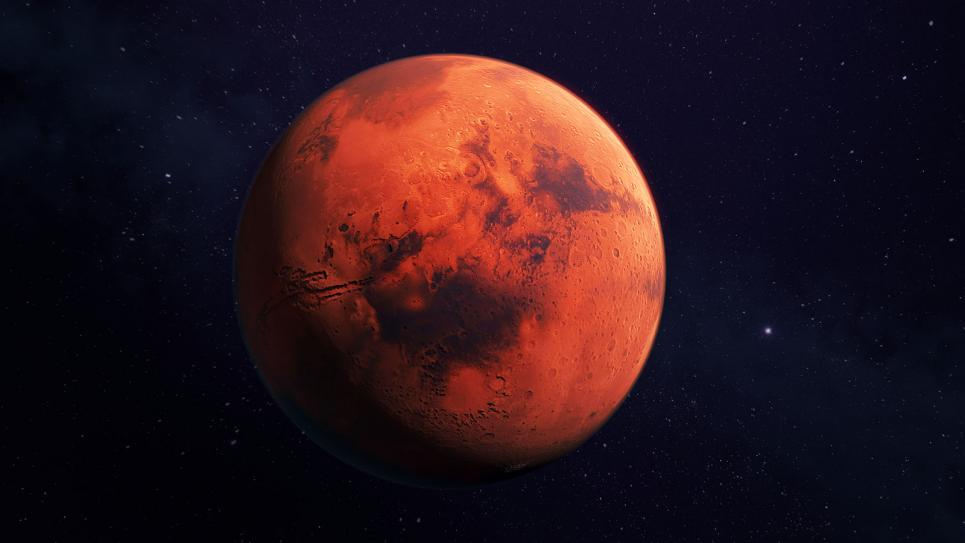

# Mission-to-Mars

### Background and Summary of the Project
To polish the web app, we need to use additional scraping code to pull the high-resolution images, updating Mongo to include the news data, and altering the design of the web app to accommodate these images. 

### Objectives

1. Use BeautifulSoup and Splinter to automate a web browser and scrape high-resolution images. 

2. Use a MongoDB database to store data from the webscrap. 

3. Update the web application and Flask to display the data from the web scrape

4. Use Bootscrap to style the web app. 

### Criteria 

1. Select html tags 

      Sekect appropriate html tags for all four hemisphere images, with no errors. 
      
2. Scrape images:

      Apply BeautifulSoup and Splinter to correctly automate a web browser and perform a web scrape
      
3. Create MongoDB 

      Create MongoDB database to correctly store data from web scrape, with one or two minor errors. 
      
4. Amend Flask Routes 

      Amend Flask routes to display all four hemisphere images, with no errors. 
